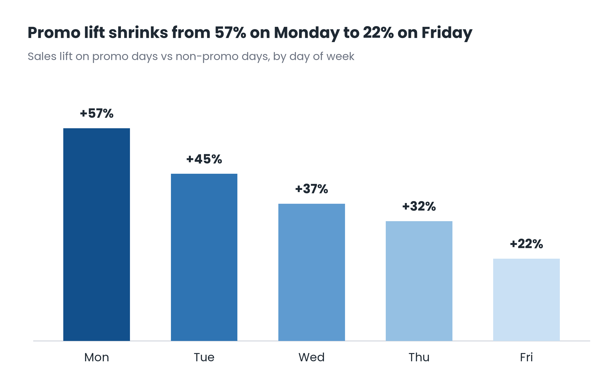
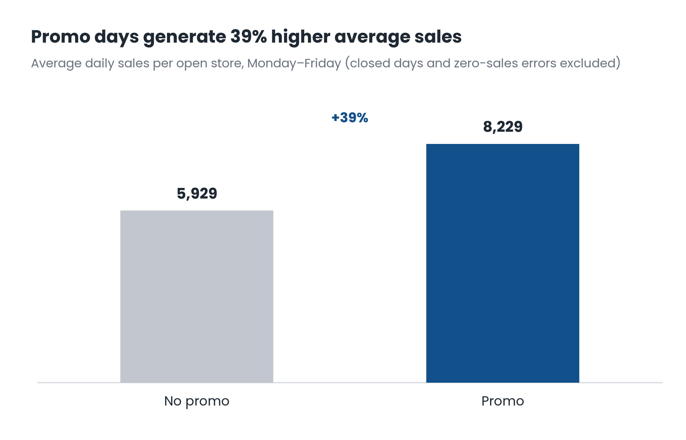

# Rossmann Store Sales: Does Running a Promo Actually Work?

## The Question

The business wants to know whether running a promotion actually drives incremental
sales, or whether it just pulls forward purchases customers would have made anyway
— and whether promo performance is consistent across the week, so spend can be
targeted more effectively.

## Data

1,017,209 store-day records across 1,115 stores (Jan 2013 – Jul 2015) from
Rossmann, a European drugstore chain (Kaggle's Rossmann Store Sales dataset).
After excluding closed-store days and a small number of data errors, and
restricting to weekdays (promos never run on weekends in this data), the working
dataset is 696,693 rows.

## Finding

Promotions do lift sales — but the size of the lift depends heavily on which day
they run, and roughly three-quarters of promo-day revenue would likely have
happened anyway.

- Overall, promo days generate **38.8% higher average sales** than non-promo days
  (€8,229 vs €5,929 per store-day), driven by both more customers (+21%) and
  higher spend per customer (+14%).
- The lift is **not uniform across the week**. It's strongest on Monday (+57%) and
  weakens steadily through the week to Friday (+22%). Two likely explanations:
  Monday promos appear to front-load pent-up weekend demand, while Friday's
  non-promo baseline is already elevated from pre-weekend shopping, leaving less
  room for a promo to add on top.
- **Ruled out a key confound:** promos run company-wide (not store-by-store), and
  the same ~1,115 stores participate on both promo and non-promo days in roughly
  equal proportion — so the lift isn't explained by which stores choose to run
  promos.

## Business Impact

Applying the average lift across all promo weekday store-days suggests roughly
**€335M/year** in incremental revenue attributable to promotions. However, this
represents only about **28% of total promo-day revenue** — the remaining ~72% is
baseline sales that likely would have occurred regardless.

A rough estimate of the Friday-specific gap: if Friday promos performed at even
the Wednesday level (+37% instead of +22%), that alone could represent an
additional **~€26M/year**.

**Caveats:** these are back-of-envelope estimates, not a rigorous causal estimate.
Promo timing is a management decision — it may cluster around periods of expected
demand rather than being randomly assigned — so some of the "lift" could reflect
favorable timing rather than the promo itself. These figures are gross revenue,
not margin, and don't account for the cost of the discount. The Friday gap may
also be structurally unfixable if pre-weekend demand is simply inelastic to
promotions, rather than a case of underperforming execution.

## Recommendation

Investigate why Friday promos underperform before assuming the gap is fixable — if
it reflects a real ceiling on pre-weekend demand, reallocating that spend to
strengthen Tuesday–Thursday promos (where the gap between actual and Monday-level
performance is larger and more likely to reflect real headroom) may be a better
use of promotional budget than trying to fix Friday.

## Tools

Python (pandas for analysis, matplotlib for visualization).

## Files

- `promo_analysis.py` — data cleaning and analysis script
- `chart1_promo_lift_by_dayofweek.png` — headline chart
- `chart2_promo_vs_nonpromo_sales.png` — supporting chart
- `train.csv`, `store.csv` — source data
- `fonts/` — bundled Poppins font files used by the chart script
